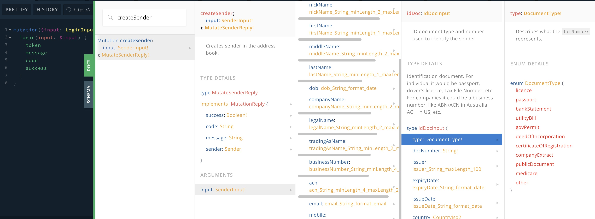

# Required fields

Most documentation examples utilise typical GraphQL input data for successfully executing queries.

It's strongly encouraged that you always submit complete and accurate data, as this reduces our compliance team's reviewing efforts and, as a result, speeds up transactions and provides a great experience for your customers.

At the same time, we recognise that gathering complete customer information can be technically challenging, particularly regarding country-specific address details or account information. As a result, our API documentation emphasises the **required** input fields based on the principle of minimal necessity.&#x20;

Please pay attention to the exclamation mark ( `!` ) next to the field type in the API schema specification from the "DOCS" section of our API Playground. Those are the required fields as it's demonstated on the screenshot below:

Please always verify that you have all required data to initiate a successful mutation or query.
