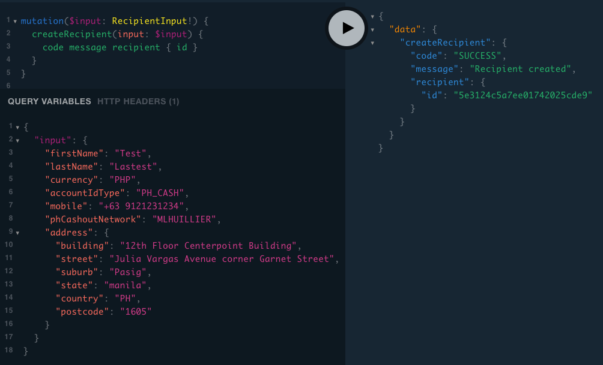

# Sending data as JSON

For your initial tests, it may be easier and more practical to send data by **embedding values** directly into the GraphQL queries and mutations, as shown in the example below.

```bash
echo '{
  "query":
    "{
       quote(input: {
         fromCurrency: AUD, toCurrency: USD, size: 9.9, currency: AUD
       })
       {
         bid ask symbol timestamp inverted
       }
     }"
}' | curl -X POST 'https://api.uat.flash-payments.com.au' \
-H 'authorization: Bearer YOUR_TOKEN' \
-H 'content-type: application/json' \
-d @-
```

At the same time, to enable efficient and accurate handling of complex queries in code, we support sending GraphQL queries as JSON objects that consist of two properties: `"query"` and `"variables"`. Here is how you can do it:

* Declare the `$input` variable in the QraphQL `"query"` string. The technology also requires you to declare the type of your input(s). See the `QueryInput` in the example below.
* Provide the `"variables"` object with the `"input"` property. The value of it must be a JSON object structured exactly as the `QueryInput` type.


Only include the top-level input argument in your GraphQL queries. Including additional types may lead to compatibility issues when schema changes are deployed in production.

If you're using third-party tools or libraries to construct GraphQL queries, be aware that they may generate unsupported structures. We recommend avoiding GraphQL libraries to reduce this risk.


```bash
echo '{
  "query":
    "query ($input: QuoteInput!) {
       quote(input: $input) { bid ask symbol timestamp inverted }
     }",
  "variables": { 
    "input": { "fromCurrency": "AUD", "toCurrency": "USD", "size": 9.9, "currency": "AUD" }
  }
}' | curl -X POST 'https://api.uat.flash-payments.com.au' \
-H 'authorization: Bearer YOUR_TOKEN' \
-H 'content-type: application/json' \
-d @-
```

Here is a screenshot of how a typical mutation looks like in the API Playground:



Same request as cURL:

```bash
echo '{
  "query":
    "mutation ($input: RecipientInput!) {
      createRecipient(input: $input) { code message recipient { id } }
    }",
  "variables": {
    "input": {
      "firstName": "Test",
      "lastName": "Lastest",
      "currency": "PHP",
      "accountIdType": "PH_CASH",
      "mobile": "+63 9121231234",
      "phCashoutNetwork": "MLHUILLIER",
      "address": {
        "building": "12th Floor Centerpoint Building",
        "street": "Julia Vargas Avenue corner Garnet Street",
        "suburb": "Pasig",
        "state": "manila",
        "country": "PH",
        "postcode": "1605"
      }
    }
  }
}' | curl 'https://api.uat.flash-payments.com.au' \
-H 'authorization: Bearer YOUR_TOKEN' \
-H 'content-type: application/json' \
-d @-
```
